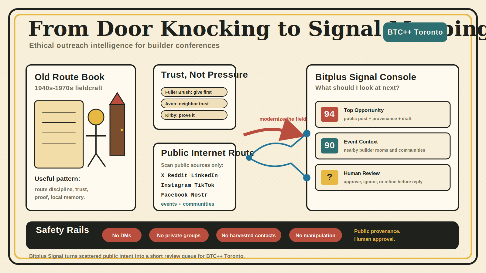

# Bitplus Signal 3-Minute Pitch

## 0:00-0:25 Problem

Event organizers waste time guessing which public conversations matter. For a developer conference like BTC++ Toronto, the best leads are not generic crypto accounts; they are builders, speakers, sponsors, privacy people, protocol people, local communities, and nearby crossover events where the right audience is already gathering.

The old door-to-door masters solved a similar problem in physical neighborhoods: who is nearby, who is ready, who trusts whom, and what is the respectful next conversation? The useful lesson is not pressure. It is fieldcraft.

## 0:25-0:55 What It Is

Bitplus Signal is an open-source public-signal console for conference outreach. Think of it as an ethical route book for the public internet.

It borrows the best Golden Age door-to-door patterns and modernizes them:

- Fuller Brush: give useful value first.
- Avon: respect neighbor trust and community memory.
- Route Man: work a reliable public route, not random noise.
- Tupperware: notice community proof where people already gather.
- Kirby: prove the signal before making a claim.
- Network Builder: map warm public proximity, then let a human decide.

The app scans public sources, normalizes posts and event pages, blocks weak or private data, then ranks the few rows a human should review next.

## 0:55-1:45 Demo

Open the app on Top Opportunities. The first card answers the organizer question: what should I look at next?

Each card shows why it matters, where it came from, its fit/confidence, and a suggested public reply written for the BTC++ account. Open the drawer to verify provenance, scoring, geo logic, source lane, and safety status.

This is the modern route card: instead of knocking every door, we review public intent signals from X, Reddit, LinkedIn, Instagram, TikTok, Facebook, Nostr, community pages, and event context. Use Advanced filters only when narrowing by platform, source lane, geography, evidence, or trust-candidate clues.

## 1:45-2:20 Safety

The safety model is public-first and human-reviewed. The old shadow side of door-to-door was manipulation, pressure, and privacy invasion; Bitplus Signal is designed against that.

It does not DM, follow, like, submit forms, harvest private contacts, or post automatically. Trust-graph-only rows are hidden by default and draftless. Generic trading, spam, private, login-gated, and weak context rows are blocked or kept out of the default view.

The rule is simple: public provenance, useful context, no coercion, human approval.

## 2:20-2:45 Why It Matters

Every community event has the same problem: attention is scattered across platforms and nearby events. Door-to-door succeeded when it had route discipline, local trust, a useful reason to talk, and a clean handoff.

Bitplus Signal brings that logic to conference growth. It turns scattered public intent into a review queue with provenance, quality classes, and draft language that sounds like a helpful community account, not a shill.

## 2:45-3:00 Ask

The Ask: help us expand this as an open-source outreach intelligence layer for technical conferences, starting with BTC++ Toronto and then reusable for any builder-focused event.

The thesis is: the next great conference growth tool is not an ad machine. It is an ethical public-route engine.
